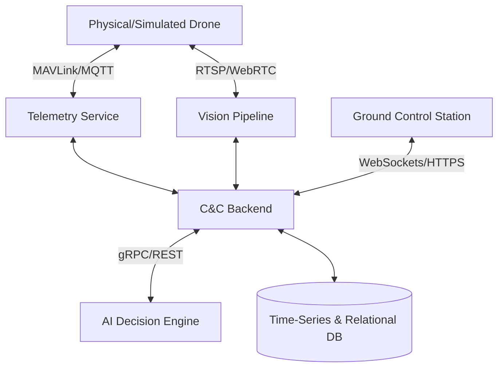

# System Architecture

The FalconZ platform utilizes a microservices-oriented architecture designed to handle high-throughput telemetry, low-latency video streaming, and complex asynchronous AI tasks.

## High-Level Components

### 1. Ground Control Station (Frontend)
- **Role**: The primary interface for drone operators.
- **Responsibilities**: Live video viewing, mission planning, real-time map visualization, and manual override controls.
- **Tech Stack Recommendations**: React/Next.js or Vue, utilizing WebRTC for video and WebSockets for live telemetry data.

### 2. Command & Control Gateway (Backend)
- **Role**: The central hub that mediates communication between the frontend, databases, and microservices.
- **Responsibilities**: User authentication, mission state management, fleet coordination, and API provisioning.
- **Tech Stack Recommendations**: Node.js/Express, Go, or Python/FastAPI.

### 3. Telemetry Service
- **Role**: Ingestion and processing of drone flight data.
- **Responsibilities**: Parsing MAVLink/custom protocols, tracking drone vitals (battery, GPS, IMU), and predictive maintenance.
- **Communication**: MQTT or WebSockets for real-time ingestion.

### 4. Vision Pipeline
- **Role**: Real-time processing of drone video feeds.
- **Responsibilities**: Object detection, tracking, landing zone identification, and hazard recognition.
- **Tech Stack Recommendations**: Python, OpenCV, YOLO/PyTorch, with GStreamer for video transport.

### 5. Autonomous Decision Engine (AI)
- **Role**: The brain behind autonomous operations.
- **Responsibilities**: Dynamic path planning, obstacle avoidance, and swarm coordination.

### 6. Simulation Environment
- **Role**: Safe testing grounds.
- **Responsibilities**: Running Software-In-The-Loop (SITL) tests mimicking real-world physics and drone behavior before hardware deployment.

## Data Flow

## Infrastructure
- **Containerization**: All services are containerized via Docker.
- **Orchestration**: Kubernetes or Docker Swarm for managing service scaling, especially for compute-intensive Vision and AI workloads.
- **Storage**: Time-series database (e.g., InfluxDB or TimescaleDB) for telemetry, and a relational database (e.g., PostgreSQL) for user and mission data.
